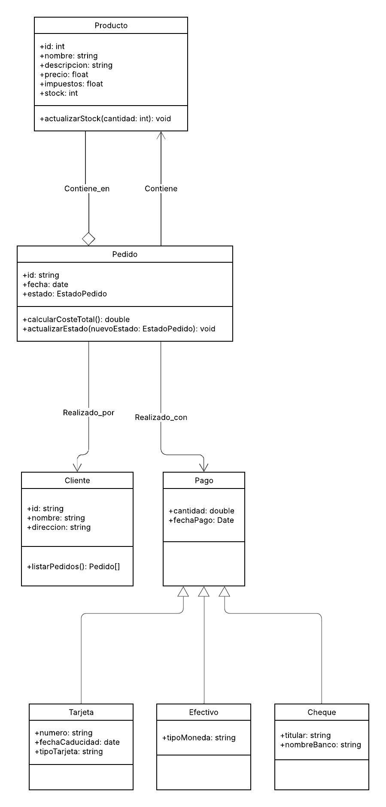

# Actividad 5.5: Diagrama de clases y generación de código para sistema de pedidos

## Diagrama de clases UML


**Explicación del diseño:**
1. **Clases principales**:
    - **`Cliente`**: Almacena datos del cliente y sus pedidos.
    - **`Pedido`**: Contiene información del pedido (fecha, estado, productos, pagos) y lógica para calcular costes.
    - **`Producto`**: Detalles del producto (nombre, precio, stock, impuestos).
    - **`LineaPedido`**: Relación entre `Pedido` y `Producto` con la cantidad solicitada.
    - **`Pago`**: Clase abstracta con subclases para cada método de pago (`Tarjeta`, `Efectivo`, `Cheque`).
    - **`EstadoPedido`**: Enum para los estados del pedido (`pdte`, `pgdo`, `pcdo`, `envdo`, `entgdo`).

2. **Relaciones**:
    - Un `Cliente` realiza múltiples `Pedidos` (agregación).
    - Un `Pedido` contiene múltiples `LineaPedido` (composición).
    - `LineaPedido` asocia un `Producto`.
    - Un `Pedido` puede tener múltiples `Pagos`.

---

### a) Elementos UML y su relación con POO
| **Concepto UML**       | **Equivalente en POO (Kotlin)**                     |
|-------------------------|----------------------------------------------------|
| Clase                   | `class` / `data class`                             |
| Herencia                | `sealed class` (para `Pago`)                       |
| Asociación              | Referencias entre objetos (ej: `Pedido` → `Cliente`) |
| Agregación              | Listas de objetos (ej: `Cliente` tiene `Pedidos`)  |
| Composición             | Objetos creados y destruidos con el contenedor     |
| Enum                    | `enum class` (para `EstadoPedido`)                 |
| Atributos/Métodos       | Propiedades y funciones en clases                  |

---

### b) Herramienta utilizada para el diagrama UML
**Herramienta elegida: Lucidchart**
- **Razones**:
    - Interfaz intuitiva con arrastrar y soltar.
    - Integración con IA para sugerencias de diseño.
    - Colaboración en tiempo real (útil para revisiones).
    - Exportación en múltiples formatos (PNG, PDF).

**Comparación con GitMind**:
- GitMind es más limitado en personalización de elementos UML.
- Lucidchart ofrece más plantillas específicas para diagramas de clases.

---

### c) Conversión del diagrama UML a código Kotlin

**Esquema del código**:

```kotlin
import java.time.LocalDate

// CLASE DE ENUMARICÓN PARA EL ESTADO DEL PEDIDO
enum class EstadoPedido { PDTE, PGDO, PCDO, ENVDO, ENTGDO }

// CLASE DE PRODUCTO DATA CLASS.
data class Producto(
    val id: String,
    val nombre: String,
    val descripcion: String,
    val precio: Double,
    val impuestos: Double,
    var stock: Int
) {

    fun actualizarStock(cantidad: Int) {
        require(stock + cantidad >= 0) { "Stock no puede ser negativo" }
        stock += cantidad
    }
}

// CLASE DE CLIENTE
data class Cliente(
    val id: String,
    val nombre: String,
    val direccion: String,
    private val pedidos: MutableList<Pedido> = mutableListOf()  // Privado para encapsulación
) {
    fun listarPedidos(): List<Pedido> = pedidos.toList()
}

// CLASE PARA EL PEDIDO, Y TE ACTUALIZA EL ESTADO MANUALMENTE CON EL METODO INCLUDIDO Y AGREGAR PAGO
class Pedido(
    val id: String,
    val cliente: Cliente,
    val fecha: LocalDate,
    val lineas: MutableList<LineaPedido> = mutableListOf(),
    var estado: EstadoPedido = EstadoPedido.PDTE
) {
    private val pagos: MutableList<Pago> = mutableListOf()

    fun calcularCosteTotal(): Double = lineas.sumOf { it.subtotal() }

    fun actualizarEstado(nuevoEstado: EstadoPedido) {
        estado = nuevoEstado
    }

    fun agregarPago(pago: Pago) {
        pagos.add(pago)
        if (pagos.sumOf { it.cantidad } >= calcularCosteTotal()) {
            estado = EstadoPedido.PGDO
        }
    }
}

// CLASE PARA EL PAGO, QUE ES UNA CLASE DE TIPO HERENCIA "sealed" PARA CADA TIPO DE PAGOO.
sealed class Pago(val cantidad: Double, val fechaPago: LocalDate)

class Tarjeta(
    cantidad: Double,
    fechaPago: LocalDate,
    val numero: String,
    val fechaCaducidad: LocalDate,
    val tipoTarjeta: String
) : Pago(cantidad, fechaPago)

class Efectivo(
    cantidad: Double,
    fechaPago: LocalDate,
    val tipoMoneda: String
) : Pago(cantidad, fechaPago)

class Cheque(
    cantidad: Double,
    fechaPago: LocalDate,
    val nombreBanco: String,
    val titular: String
) : Pago(cantidad, fechaPago)

// CLASE PARA LA LINEA DEL PEDIDO, Y MANTENEMOS LA LÓGICA DLE CALCULO
class LineaPedido(
    val producto: Producto,
    val cantidad: Int
) {
    fun subtotal(): Double = cantidad * (producto.precio * (1 + producto.impuestos))
}

fun main() {

    val producto = Producto(
        "qclvbQs69hhaCmImXBlFOw==",
        "Laptop",
        "Portátil de 15 pulgadas",
        999.99,
        0.21,
        10
    )

    val cliente = Cliente("C1", "Ana", "Calle Principal 123")

    val pedido = Pedido("P1", cliente, LocalDate.now())
    pedido.lineas.add(LineaPedido(producto, 2))

    println("Total pedido: ${pedido.calcularCosteTotal()}") /* OUTPUT ESPERADO: 'Total pedido: 2419.9758' */
}
```

**¿Que decisiones he tomado para hacer el esquema?**:
1. **`sealed class` para pagos**: Permite modelar métodos de pago con atributos específicos de forma segura.
2. **Cálculo de total**: Se realiza iterando sobre las `LineaPedido`, incluyendo impuestos.
3. **Gestión de estados**: El estado se actualiza automáticamente al registrar pagos.
4. **Stock en `Producto`**: Se deja como propiedad mutable para actualizarlo al procesar pedidos.